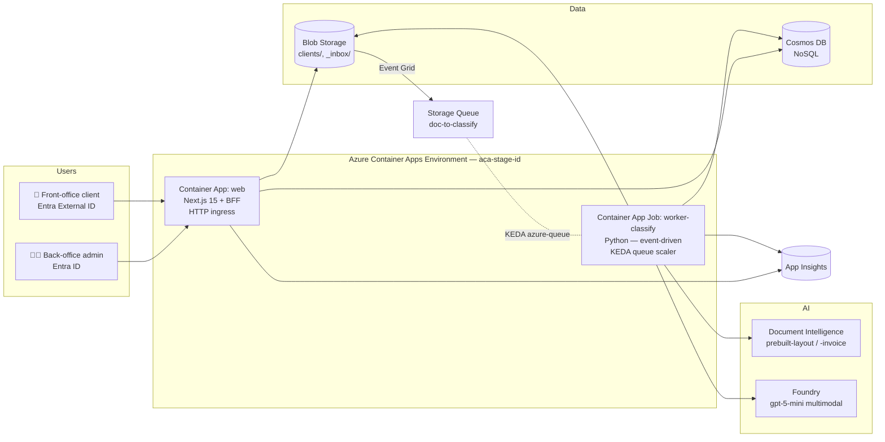

# DESIGN — `mailroom-ia`

> **Le HOW** : architecture, choix techno, modèle de données, décisions.  
> Pour le **WHAT** (périmètre fonctionnel, jalons), voir [SPEC.md](SPEC.md).

---

## 1. Architecture cible

Toute l'exécution runtime vit dans **un seul Azure Container Apps Environment**.



> 📐 Un diagramme drawio plus riche viendra remplacer/compléter ce Mermaid quand le design sera figé.

### Composants

| # | Nom | Type ACA | Rôle |
|---|-----|----------|------|
| 1 | `web` | Container App (HTTP ingress) | Next.js 15 — frontend (admin + client) + BFF |
| 2 | `worker-classify` | Container App Job (event-driven) | Python — consume queue, OCR, classify, range |
| 3 | `cron-cleanup` *(jalon ult.)* | Container App Job (scheduled) | Purge `_inbox/` ancien, archivage |

### Flux d'ingestion

```
Upload PDF (admin)
     │
     ▼
Blob: _inbox/<uuid>.pdf
     │
     Event Grid subscription
     ▼
Storage Queue: doc-to-classify
     │
     KEDA scaler (queueLength=1, parallelism=4)
     ▼
ACA Job: worker-classify (1 exec = 1 msg)
     ├─→ Document Intelligence (layout + invoice si applicable)
     ├─→ Foundry gpt-5-mini (identification client + catégorie)
     ├─→ Si confidence ≥ 0.8 : Blob move → clients/<client>/<cat>/<sub>/
     │   Sinon : reste dans _inbox/ avec needsReview=true
     └─→ Cosmos upsert
```

---

## 2. Choix techno

| Couche | Choix retenu | Alternatives écartées & raison courte |
|--------|--------------|---------------------------------------|
| Runtime | **Azure Container Apps Environment** (Apps + Jobs event-driven, KEDA) | *Functions Flex* : plus simple mais hétérogène avec le frontend container · *AKS* : overkill pour 1 000 docs/jour |
| Frontend + BFF | **Next.js 15 App Router** monolithique (frontend + Route Handlers BFF) + React 19 + TypeScript strict | *Next + FastAPI séparé* : duplication des types · *Vite + backend* : pas de SSR (perf mobile) |
| UI | **Tailwind CSS** + **shadcn/ui** + lucide-react | MUI/Chakra : trop opinionated · CSS-in-JS runtime : perf mobile |
| Worker | **Python 3.13** containerisé, entrypoint `python -m worker.main`, KEDA `azure-queue` | Functions : cf. ligne runtime |
| Auth | **Entra External ID** (clients) + **Entra ID** (admins) via NextAuth.js / Auth.js | Auth0/Clerk : pas dans le tenant Azure · maison : non |
| Stockage docs | **Azure Blob Storage** (hot tier) hiérarchique | NFS/Files : moins scalable, plus cher |
| Métadonnées | **Cosmos DB NoSQL** — containers `documents` et `clients` | SQL : schéma trop rigide (catégories évolutives) · Table : pas assez riche |
| Classification IA | **Hybride** Document Intelligence + LLM Foundry (gpt-5-mini, multimodal opt.) | DI seul : pas de raisonnement client · LLM seul : OCR moins fiable · cf. §3.3 |
| Event bridge | **Event Grid** (Blob → Storage Queue) | Service Bus : overkill · webhook custom : moins fiable |
| Observabilité | **Application Insights** + Log Analytics au niveau ACA Environment + OpenTelemetry (`azure-monitor-opentelemetry` côté worker) | Datadog : payant · maison : non |
| Secrets | **Managed Identity** partout. **Key Vault** uniquement pour secrets de services *tiers* non-Azure | Clés dans env vars : interdit (cf. instructions) |
| IaC | **Bicep** (jalon 4) | Terraform : ok mais Bicep est natif Azure et plus simple ici |
| CI/CD | **GitHub Actions** : build image → push ACR → revision ACA | Azure Pipelines : ok mais GitHub Actions = repo déjà sur GitHub |

---

## 3. Détails par couche

### 3.1 Frontend `web`

- App Router en TypeScript strict, Server Components par défaut.
- Routes groupées : `app/(admin)/`, `app/(client)/`, `app/api/` (BFF).
- Auth via Auth.js (OIDC Entra). Sessions httponly cookies.
- Cf. [`.github/instructions/frontend-design.instructions.md`](../../.github/instructions/frontend-design.instructions.md) pour les règles détaillées.

### 3.2 Worker `worker-classify`

- Image Python 3.13-slim. Entrypoint long-running qui poll la queue (ou simple consumer si KEDA Job 1:1).
- Logique métier dans `worker/classify.py` (module pur, testable).
- Adapters Azure dans `worker/adapters/` (DI, Foundry, Blob, Cosmos, Queue).
- Cf. [`.github/instructions/python-quality.instructions.md`](../../.github/instructions/python-quality.instructions.md) et [`.github/instructions/python-fastapi.instructions.md`](../../.github/instructions/python-fastapi.instructions.md).

### 3.3 Classification hybride DI + LLM

**Pipeline résumé** :

1. Document Intelligence : `prebuilt-layout` (toujours) + `prebuilt-invoice` (si applicable) → texte OCR + champs structurés.
2. **Fast path** : si `prebuilt-invoice` retourne un `CustomerName` matchant exactement **un** client (confiance ≥ 0.95) → on classe `factures/<année>/` directement, on skip le LLM.
3. Sinon, **LLM Foundry** (`gpt-5-mini`) :
   - System prompt avec catalogue catégories + liste clients (top-20 si > 100 clients via embedding).
   - Texte OCR (truncate 8 000 chars) en user message.
   - **Output JSON strict** via `text_format=ClassificationOutput` (Pydantic).
4. Décision :
   - `confidence ≥ 0.8` → range automatique vers `clients/<id>/<cat>/<sub>/`.
   - sinon → reste dans `_inbox/`, flag `needsReview = true`.

**Pourquoi hybride et pas DI seul ?**
- DI excelle en OCR et champs structurés, mais ne sait pas faire de matching flou de client ou de classification métier custom (impôts, CAF, médical…).
- LLM seul ferait l'OCR moins bien et plus cher.
- Hybride : ~0,03 €/doc, ~10 s p95, ≥ 90 % de précision attendue.

**Cf.** [`.github/instructions/classification-hybride.instructions.md`](../../.github/instructions/classification-hybride.instructions.md) pour le code complet, prompts, métriques cibles.

### 3.4 Sécurité

- **Tout** entre les services Azure passe par **Managed Identity** (System-Assigned côté Container Apps).
- Roles RBAC au scope ressource (Storage Blob Data Contributor, Cosmos DB Built-in Data Contributor, Cognitive Services OpenAI User, Cognitive Services User pour DI).
- Pas un seul secret Azure en env var. Key Vault uniquement pour secrets tiers.
- HTTPS only, TLS 1.2+, HSTS activé côté Next.
- Inputs validés systématiquement avec Zod (TS) / Pydantic (Py).
- Content Safety + Prompt Shields activés sur le déploiement modèle Foundry.
- Cf. [`.github/instructions/azure-managed-identity.instructions.md`](../../.github/instructions/azure-managed-identity.instructions.md).

---

## 4. Modèle de données

### Blob Storage — hiérarchie

```
<storage-account>/<container=mailroom>/
├── _inbox/                             ← docs uploadés ou en revue
│   └── <upload-uuid>.pdf
└── clients/
    └── <client-id>/
        ├── factures/
        │   └── <année>/
        │       └── YYYY-MM-DD_<slug>.pdf
        ├── contrats/
        │   ├── assurance/
        │   ├── bancaire/
        │   ├── telecom/
        │   └── autre/
        ├── avis-officiels/
        │   ├── impots/
        │   ├── caf/
        │   ├── prefecture/
        │   ├── tribunal/
        │   └── autre/
        ├── courriers/
        │   ├── medical/
        │   ├── professionnel/
        │   └── autre/
        └── autres/
```

### Cosmos DB — container `documents` (partition `/clientId`)

```jsonc
{
  "id": "<doc-uuid>",
  "clientId": "<client-uuid>",
  "blobPath": "clients/abc-123/factures/2026/2026-06-05_facture-edf.pdf",
  "originalName": "scan_2026-06-05.pdf",
  "mimeType": "application/pdf",
  "sizeBytes": 248531,
  "category": "factures",
  "subCategory": "2026",
  "uploadedBy": "admin@contoso.com",
  "uploadedAt": "2026-06-05T10:32:00Z",
  "classifiedAt": "2026-06-05T10:32:14Z",
  "classification": {
    "model": "gpt-5-mini",
    "confidence": 0.92,
    "needsReview": false,
    "reasoning": "Facture EDF identifiée, client Dupont matché par nom exact.",
    "diUsed": ["prebuilt-layout", "prebuilt-invoice"],
    "totalCostEur": 0.028
  }
}
```

### Cosmos DB — container `clients` (partition `/id`)

```jsonc
{
  "id": "<client-uuid>",
  "displayName": "Dupont, Jean",
  "email": "jean.dupont@example.com",
  "entraExternalId": "<oid>",
  "createdAt": "2026-06-01T09:00:00Z",
  "createdBy": "admin@contoso.com"
}
```

---

## 5. Historique des décisions

> Format chronologique. Pour les détails de raisonnement (options envisagées, tradeoffs), voir le tableau §2.

| Date | Décision | Notes |
|------|----------|-------|
| 2026-06-05 | Stack frontend : **Next.js 15 App Router** monolithique (frontend + BFF). | Cohérence types front/BFF, vélocité MVP. Réversible si besoin de scaler le backend indépendamment. |
| 2026-06-05 | Classification : **hybride DI + LLM Foundry**. | DI seul ne suffit pas (pas de matching flou client). Seuil de confiance 0.8 par défaut, configurable. |
| 2026-06-05 | Runtime : **Azure Container Apps Environment** (Apps + Jobs event-driven, KEDA). | Homogénéité stack containers, portable AKS, pédagogique. Remplace une 1ère intention Functions Flex. |

---

## 6. Déploiement

### CI/CD (jalon ultérieur)

```
push sur main
  │
  ▼
GitHub Actions :
  1. Lint + tests (web + worker en parallèle)
  2. Build Docker → push vers ACR
  3. az containerapp update --image <tag>
       pour `web` et `worker-classify`
  4. Smoke test sur l'ingress web
```

### Environnements

| Env | RG | Trigger | Approbation |
|-----|----|---------| ------------|
| `dev` | `rg-stage-<id>` (le RG du stagiaire) | push sur `main` | auto |
| `staging` *(plus tard)* | RG dédié | tag `v*-rc*` | auto |
| `prod` *(plus tard)* | RG dédié | tag `v*` | manuelle |

Pour le POC : on déploie tout dans `rg-stage-<id>`, environnement unique.
